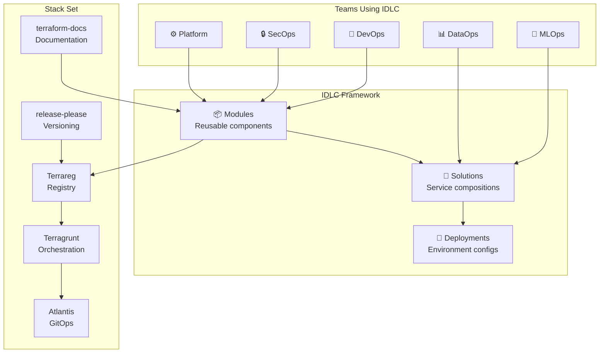
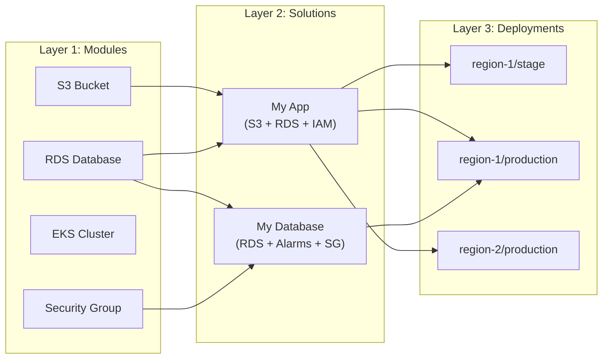
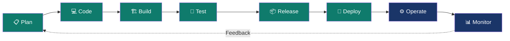
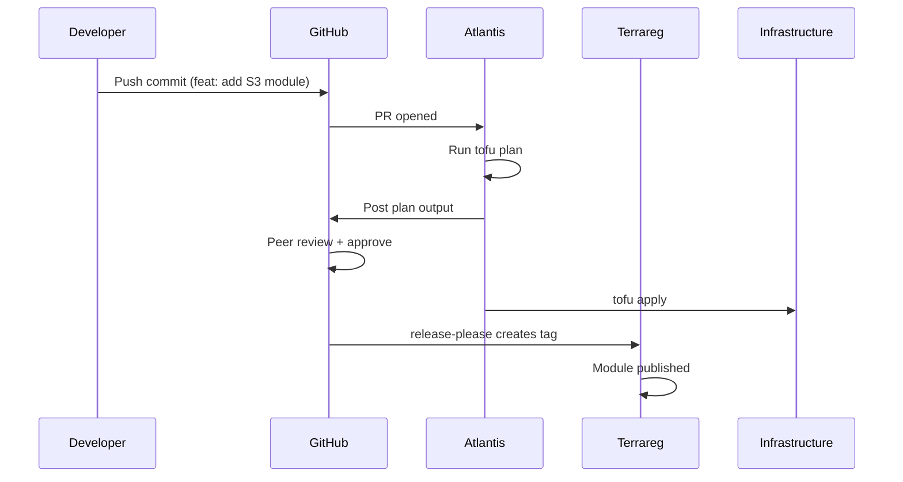

# Framework Overview

The IDLC framework brings structure to infrastructure management across distributed teams. This page provides a visual overview of how the pieces fit together.

## How Teams Use IDLC

## The Three Layers

Each layer has a specific responsibility and interacts with the others through well-defined interfaces.

## The Lifecycle Flow

The 8 phases create a continuous loop from planning to monitoring:

## The GitOps Workflow

Every infrastructure change follows the same path — from code to production:

## Why This Matters

| Without IDLC | With IDLC |
|:-------------|:----------|
| Each team has different patterns | One framework, shared conventions |
| Manual deployments in production | Zero-touch GitOps deployments |
| No module reuse across teams | Shared registry with versioned modules |
| Security policies applied inconsistently | Security baked into module defaults |
| AI tools struggle with inconsistent code | AI-friendly structure and conventions |
| Onboarding takes weeks | New teams inherit proven practices from day one |

## Next Steps

- Deep dive into [Modules]({{ "/docs/concepts/modules.html" | relative_url }}), [Solutions]({{ "/docs/concepts/solutions.html" | relative_url }}), and [Deployments]({{ "/docs/concepts/deployments.html" | relative_url }})
- Explore the [8 Phases]({{ "/docs/phases/" | relative_url }}) in detail
- Review the [Stack Set]({{ "/docs/stackset/" | relative_url }}) toolchain
